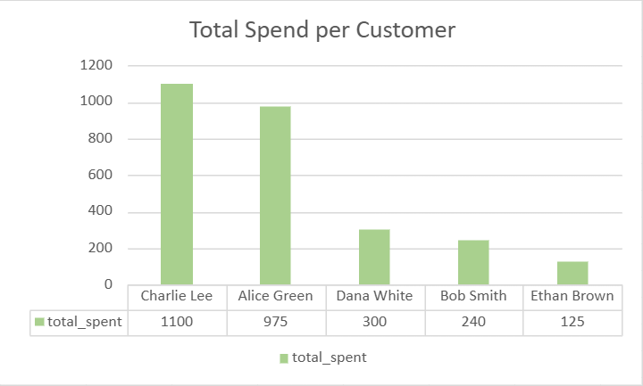
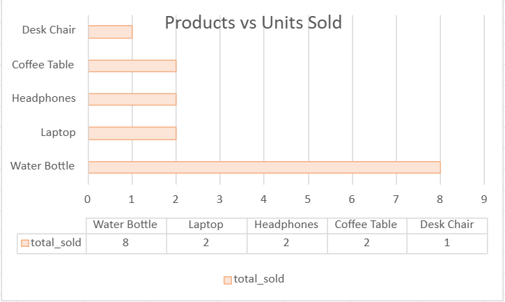
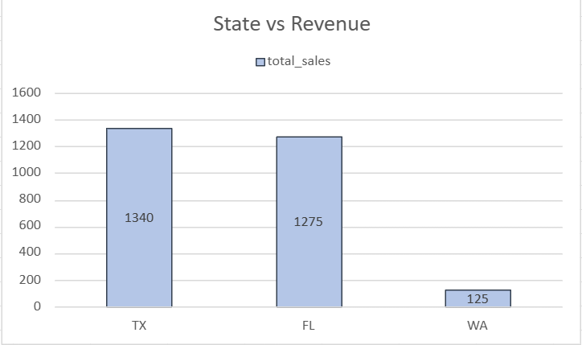
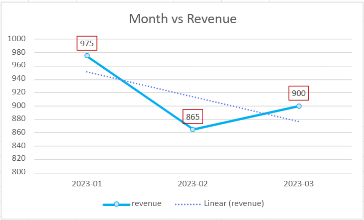

# E-Commerce Sales Analysis

A SQL-based case study analyzing customer purchasing behavior, product performance, and regional sales trends to generate actionable business insights.

---

## Overview

| Detail | Info |
|--------|------|
| **Objective** | Analyze customer purchases, product performance, and regional sales trends using SQL joins and aggregations |
| **Tools** | SQLite, Microsoft Excel |
| **Skills** | SQL joins, aggregations, date functions, pivot tables, data visualization |

---

## Database Schema

Three relational tables were created to support the analysis:

- **Customers** — Customer details including city and state
- **Products** — Product catalog with categories and pricing
- **Orders** — Purchase transactions linking customers to products

---

## Analysis

### 1. Total Spend per Customer

**Key Findings:**
- Highest spender: Charlie Lee
- High-volume, low-value purchaser: Ethan Brown

**Recommendation:** Implement loyalty programs and personalized marketing to increase average order value among high-frequency, low-spend customers.

```sql
SELECT c.name, sum(p.price * o.quantity) AS total_spent
FROM customers c
JOIN Orders o ON c.customer_id = o.customer_id
JOIN Products p ON o.product_id = p.product_id
GROUP BY c.name
ORDER BY total_spent DESC;
```


*Bar chart — Customer vs. Total Spend*

---

### 2. Top Selling Products

**Key Findings:**
- Water Bottles had the highest units sold
- Laptops generated the highest revenue per unit

**Recommendation:** Optimize inventory for high-volume items and run targeted promotions for high-margin products.

```sql
SELECT p.product_name, SUM(o.quantity) AS total_sold
FROM Orders o
JOIN Products p ON o.product_id = p.product_id
GROUP BY p.product_name
ORDER BY total_sold DESC;
```


*Horizontal bar chart — Product vs. Units Sold*

---

### 3. Sales by State

**Key Findings:**
- Florida produced the highest overall revenue
- Washington shows potential as a growth market

**Recommendation:** Prioritize regional marketing campaigns in high-performing states while developing strategies to capture emerging markets.

```sql
SELECT c.state, SUM(p.price * o.quantity) AS total_sales
FROM Customers c
JOIN Orders o ON c.customer_id = o.customer_id
JOIN Products p ON o.product_id = p.product_id
GROUP BY c.state
ORDER BY total_sales DESC;
```


*Column chart — State vs. Revenue*

---

### 4. Monthly Sales Trend

**Key Findings:**
- February saw peak sales activity
- January showed the lowest activity across the period

**Recommendation:** Align seasonal marketing campaigns and inventory planning around identified high and low periods.

```sql
SELECT strftime('%Y-%m', o.order_date) AS month,
       SUM(p.price * o.quantity) AS revenue
FROM Orders o
JOIN Products p ON o.product_id = p.product_id
GROUP BY strftime('%Y-%m', o.order_date)
ORDER BY month;
```


*Line chart — Month vs. Revenue*

---

## Files

| File | Description |
|------|-------------|
| `ecommerce_analysis.db` | SQLite database |
| `ecommerce sales analysis - pivot tables & visuals.xlsx` | Excel visualizations and pivot tables |

---

## Author

**Valencia Cummings**
